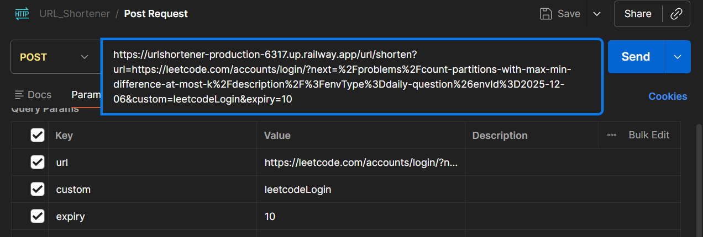
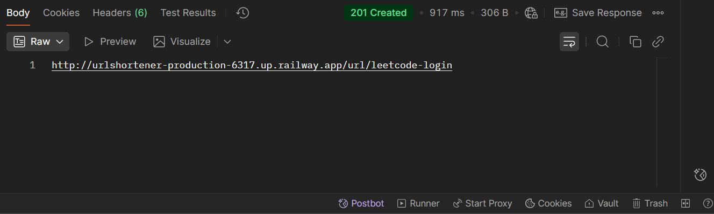

# URL Shortener (Spring Boot)

A simple and fast backend application that converts long URLs into short shareable URLs.

🚀 REST API Endpoints

🔹 Create Short URL
POST /url/shorten?url=<longUrl>&expiry=<minutes>&custom=<optionalCode>

🔹 Redirect to Original URL
GET /url/{shortCode}

    
---

## 📌 Features
- Shorten long URLs
- Optional custom short code
- Expiry time for each URL
- Auto-expired URL cleanup
- 302 Redirect support
- Fast in-memory storage using ConcurrentHashMap
- Deployed on Railway (Free Tier)

---

## 🛠️ Tech Stack
| Component | Technology |
|----------|------------|
| Backend | Java, Spring Boot |
| Build Tool | Maven |
| Cloud Hosting | Railway |
| Storage | ConcurrentHashMap (In-memory) |

---

| Parameter | Required | Description |
|----------|----------|-------------|
| url | ✔ | Full URL to shorten (must start with http/https) |
| expiry | ✔ | Expiry time in minutes |
| custom | ❌ | Your custom short code |

Example:

https://urlshortener-production-6317.up.railway.app/url/shorten?url=https://leetcode.com/accounts/login/?next=%2Fproblems%2Fcount-partitions-with-max-min-difference-at-most-k%2Fdescription%2F%3FenvType%3Ddaily-question%26envId%3D2025-12-06&custom=leetcodeLogin&expiry=10

Example Response:

http://urlshortener-production-6317.up.railway.app/url/leetcodeLogin  
(valid for 10 minutes, as we mentioned the expiry time)

---

### 🔹 Redirect to Original URL

Just open the shortened URL in browser: http://urlshortener-production-6317.up.railway.app/url/leetcodeLogin

➡ Automatically redirects to the original long URL

---

## 🧪 Testing Options
You can test using:
- Web Browser
- Postman
- curl

Example(Postman)
## 📸 Screenshots

### 🔹 Shorten URL API (Postman)

### 🔹 Redirect Test (Browser)

---

## 🔮 Future Enhancements
- Add Database (Redis/PostgreSQL) for persistent storage
- Click analytics `/stats/{code}`
- Swagger API Documentation
- Frontend UI webpage for generating short URLs
- QR code generation for short URLs

---

## 👤 Author
**Ashish Mishra**  
B.Tech IT – Backend Developer  
